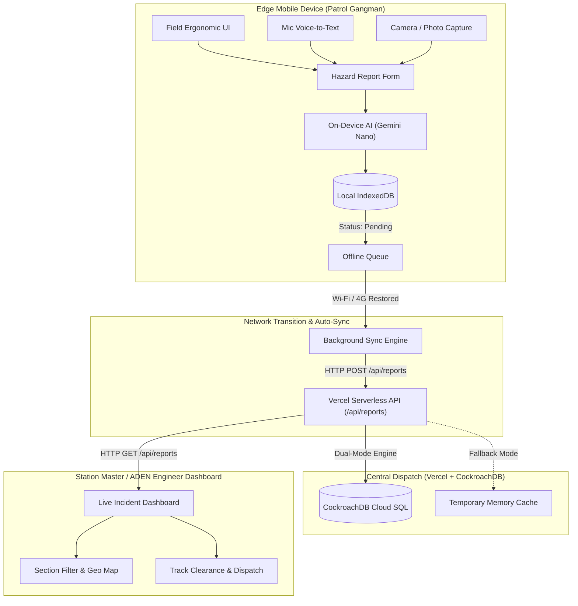

# Gangman's Logbook — DHR Track Inspector

> **Offline-First, Mobile-First PWA & Central Dispatch System for the Darjeeling Himalayan Railway (UNESCO World Heritage)**  
> **Code for Communities — Darjeeling Himalayan Railway Edition · GDG Siliguri**  
> **Track C · Problem Statement C1** (Permanent-Way Maintenance & Hazard Reporting)

[](https://code-for-communities-toy-train-edit.vercel.app/)
[](https://youtube.com/shorts/ewLzl7GmfCk?feature=share)
[](https://developer.mozilla.org/en-US/docs/Web/Progressive_web_apps)
[](https://cockroachlabs.cloud)
[](https://developer.chrome.com/docs/ai/built-in)
[](#-multilingual-localization-en--ne--hi--bn)

> **Live Video Demonstration**: [**Watch Gangman's Logbook on YouTube Shorts**](https://youtube.com/shorts/ewLzl7GmfCk?feature=share)

---

## Live Application & Video Demo

| Resource | Link | Description |
| :--- | :--- | :--- |
| **Video Demonstration** | [**Watch YouTube Shorts Demo**](https://youtube.com/shorts/ewLzl7GmfCk?feature=share) | 60-second mobile field inspection walkthrough |

[](https://youtube.com/shorts/ewLzl7GmfCk?feature=share)


## Real-World Problem & Field Context

The **Darjeeling Himalayan Railway (DHR)** operates an 88 km narrow-gauge alignment carved into steep Himalayan slopes between New Jalpaiguri (NJP) at 100m elevation and Ghum at 2,258m. 

Track Gangmen walk this mountain line daily through torrential monsoon rains, frequent landslides at Pagla Jhora, boulder falls, and dense fog. When hazards are spotted, **zero cellular connectivity** in deep gorges makes conventional reporting apps fail. Trackmen traditionally rely on handwritten diaries, leading to critical delays in alerting Station Masters and Assistant Divisional Engineers (ADEN).

**Gangman's Logbook** solves this with a purpose-built, **offline-first PWA** that captures, analyzes with on-device AI, and queues hazard reports in airplane mode, automatically synchronizing with Central Dispatch the moment connectivity is restored.

---

## Key Features

### 1. 100% Offline-First Architecture (Airplane Mode Tested)
- **Local Database (IndexedDB)**: Reports, GPS coordinates, hazard photos, severity classifications, and audio notes are stored locally in milliseconds without blocking or waiting for network handshakes.
- **Service Worker (`v6`)**: Comprehensive asset precaching across all views, CSS, JS, audio assets, and fonts.
- **Background Sync Engine**: Utilizes the native Service Worker `sync` event with automated `online` fallbacks to batch-upload pending reports when reaching station Wi-Fi or 4G coverage.

### 2. Unified Full-Stack Vercel Deployment & CockroachDB
- **Global Edge Frontend**: Instant zero-cold-start delivery from Vercel's global CDN.
- **Serverless Dispatch API (`/api/reports`)**: Handles `GET`, `POST`, `DELETE`, and `OPTIONS` under the same origin—no CORS setup required.
- **Permanent Cloud Persistence**: Powered by **CockroachDB Serverless** (Distributed PostgreSQL) for indestructible, multi-region hazard logging across cold starts, with zero-config fallback to `/tmp` and local memory for instant testing.
- **Bidirectional Station Sync**: When Station Masters or ADEN engineers open their Dashboard, `pullCentralReports()` automatically retrieves and merges logs submitted across all patrol gangs.

### 3. Mobile-First Field Ergonomics & Sunlight Mode
- **48px+ Touch Targets**: Sized for cold mountain hands, thick work gloves, and turbulent track walking.
- **Tactile 2×2 Severity Matrix**: Instant single-thumb classification across `Low`, `Medium`, `High`, and `Critical` urgency levels.
- **Outdoor Sunlight Mode**: High-contrast daylight theme providing maximum visibility under harsh mountain glare and monsoon overcast.
- **Safe Area Inset Aware**: Fully compatible with phone notches and gesture bars (`env(safe-area-inset)`).
- **No-Zoom Inputs**: Typographic scaling prevents disruptive auto-zooming on mobile browsers.

### 4. Multilingual Localization (EN · NE · HI · BN)
Immediate one-tap switching across 4 languages representing the track gang community:
- **English (EN)**: Official railway engineering terminology.
- **Nepali (नेपाली)**: Primary mother tongue of Darjeeling & Kurseong trackmen.
- **Hindi (हिन्दी)**: Northeast Frontier Railway (NFR) administrative standard.
- **Bengali (বাংলা)**: Regional North Bengal standard.

### 5. On-Device Hybrid AI System
- **Chrome Prompt API (`window.ai` / Gemini Nano)**: On-device natural language classification and automated summary synthesis without server API keys.
- **Computer Vision Heuristic Engine**: Real-time canvas analysis inspecting brightness, contrast, and RGB spectrum to detect landslide mud, rail rust, or water pooling.
- **Multilingual Offline Rule Engine**: 100% reliable fallback logic executing in under 2ms even when device AI hardware is unavailable.

### 6. DHR Track Alignment & Auto-GPS
- Mathematical projection onto the 88 km narrow-gauge curve (13 consecutive mountain sections).
- Auto-selects the nearest section (e.g., *Batasia Loop*, *Pagla Jhora*, *Tindharia*).
- Auto-calculates approximate railway Kilometer Marker (KM 0 to 88).
- One-tap quick presets for high-risk zones.

---

## End-to-End System Architecture



---

## REST API Specification

The backend serverless function is located at [`api/reports.js`](file:///c:/Users/shran/my_projects/My%20Projects/code-for-communities-toy-train-edition/api/reports.js) and exposes:

### `GET /api/reports`
Returns all centralized track inspection logs.
- **Response**: `200 OK`
- **Header**: `X-DHR-Storage-Mode: CockroachDB-Cloud` (or `Serverless-Ephemeral`)
- **Body**: Array of hazard report objects.

### `POST /api/reports`
Saves or updates a track hazard report from patrol staff.
- **Payload**:
  ```json
  {
    "id": "REP-1725519800000",
    "hazardType": "landslide",
    "severity": "critical",
    "section": "batasia-loop",
    "kmMarker": 82.4,
    "notes": "Large mudslip blocking both rails after continuous rainfall",
    "timestamp": "2026-09-05T07:15:00.000Z",
    "location": { "lat": 27.0167, "lng": 88.2467, "accuracy": 12 },
    "language": "ne"
  }
  ```
- **Response**: `200 OK`
  ```json
  {
    "success": true,
    "id": "REP-1725519800000",
    "total": 14,
    "storage": "CockroachDB Cloud (Permanent)",
    "message": "Report committed to Central Dispatch Cloud Database"
  }
  ```

### `DELETE /api/reports`
Admin endpoint to clear central records for drills or shift transitions.
- **Response**: `200 OK`

---

## Deployment Guide

### Option A: Deploy to Vercel (Recommended)

> **Active Production Deployment**: [**https://code-for-communities-toy-train-edit.vercel.app/**](https://code-for-communities-toy-train-edit.vercel.app/)

1. Fork or push this repository to GitHub.
2. Go to **[vercel.com/new](https://vercel.com/new)**.
3. Import repository `code-for-communities-toy-train-edition`.
4. Leave settings as default (**Framework Preset: Other**, **Root Directory: `./`**).
5. Click **Deploy**. Both the static PWA frontend and `/api/reports` serverless backend build together instantly.

---

### Option B: Local Development & Mobile Testing

#### 1. Start Local Server
```powershell
python server.py
```
*(Runs full-stack on `http://localhost:3000` with local REST API).*

#### 2. HTTPS Tunnel for Mobile Device Testing
Camera, microphone, and geolocation APIs require a secure origin (HTTPS). Start an instant mobile tunnel:
```powershell
npx -y localtunnel --port 3000
```
Open the generated HTTPS URL on your phone to test the app as a real track gangman.

---

## Hackathon Rubric Alignment

| Criterion | Weight | How Gangman's Logbook Delivers |
| :--- | :---: | :--- |
| **Offline-First & Reliability** | **25%** | Complete autonomy in Airplane Mode. IndexedDB local storage, Service Worker cache v6, and resilient Background Sync queue that never drops a hazard report. |
| **Community Impact** | **25%** | Empowers frontline Northeast Frontier Railway trackmen guarding an irreplaceable 140-year-old UNESCO World Heritage railway in harsh weather. |
| **AI Integration** | **25%** | Hybrid on-device AI combining Chrome Prompt API (Gemini Nano) with real-time computer vision heuristics and zero-latency multilingual fallbacks. |
| **Design & Accessibility** | **25%** | Rigorous 48px+ touch targets, single-thumb 2×2 severity grid, outdoor sunlight mode, voice reporting, and 4 regional languages (EN, Nepali, Hindi, Bengali). |

---

## Project Structure

```
├── api/
│   └── reports.js             # Vercel Serverless Function (Dual-mode CockroachDB + Fallback)
├── assets/
│   ├── icon-192.png           # PWA Home Screen Icon
│   ├── icon-512.png           # PWA Splash Screen Icon
│   └── audio/                 # Emergency audio sirens and alerts
├── css/
│   ├── base.css               # Design tokens, reset, typography, safe areas
│   ├── components.css         # Buttons, cards, modals, touch targets
│   ├── forms.css              # 2x2 grids, camera previews, sunlight styles
│   └── dashboard.css          # Live incident board, status chips, charts
├── data/
│   └── reports.json           # Default seed inspection reports
├── js/
│   ├── app.js                 # App controller, view transitions, navigation
│   ├── db.js                  # IndexedDB CRUD engine & remote merge logic
│   ├── sync.js                # Background Sync & bidirectional central pull
│   ├── camera.js              # Camera stream, file uploads, canvas vision
│   ├── gps.js                 # Geolocation & 88km DHR curve projection
│   ├── ai.js                  # Gemini Nano / Chrome Prompt API & heuristics
│   ├── i18n.js                # English, Nepali, Hindi, Bengali dictionaries
│   ├── dashboard.js           # Live track logbook & incident statistics
│   └── voice.js               # Web Speech API multilingual voice-to-text
├── index.html                 # Semantic single-page application shell
├── manifest.json              # Web App Manifest (standalone, theme colors)
├── sw.js                      # Service Worker v6 (asset caching & sync handler)
├── vercel.json                # Vercel configuration (headers, cleanUrls, sw scope)
├── package.json               # Project manifest & dependencies (pg for CockroachDB)
├── server.py                  # Python local server with built-in REST API
└── README.md                  # Comprehensive technical documentation
```

---

## 📜 License & Credits

Built with pride for the **Darjeeling Himalayan Railway** track crews.  
Developed for **Code for Communities — GDG Siliguri Hackathon**.  
Released under the [MIT License](LICENSE).
